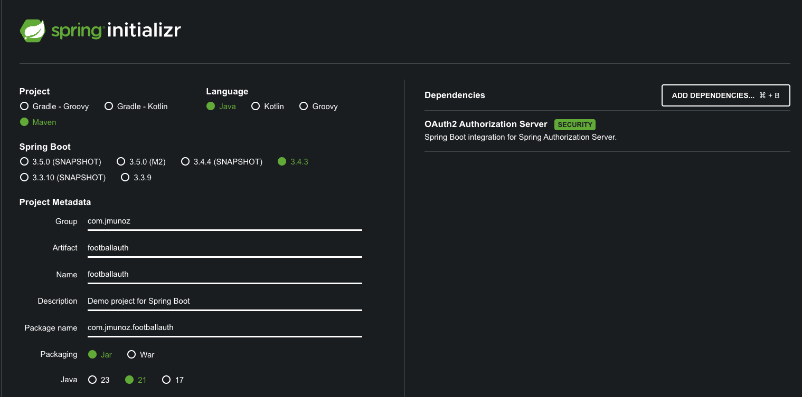
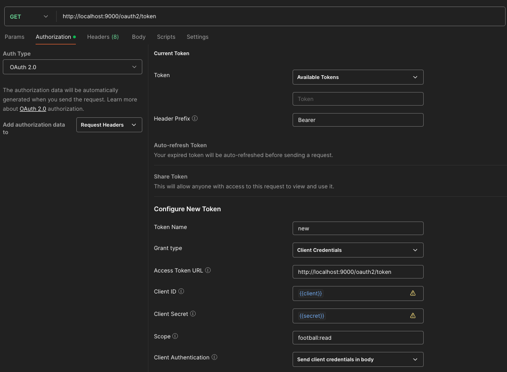
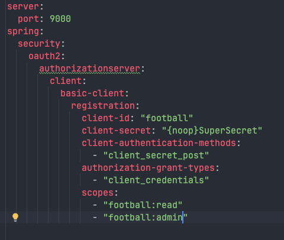

# SPRING BOOT 3 COOKBOOK

Configuración de un Authorization Server en Spring.

Se usa `Spring` y la dependencia `OAuth2 Authorization Server`.

## Creación de proyecto

Uso Spring Initializr: `https://start.spring.io/`



## Ejecución del proyecto

- Clonar/descargar este proyecto
- Ejecutar el proyecto con el comando: `./mvnw spring-boot:run`
    - O ejecutar directamente desde IntelliJ Idea
- Podemos recuperar la configuración de nuestro server haciendo una petición a `http://localhost:9000/.well-known/openid-configuration`
  - Este endpoint lo implementan todos los proveedores de OAuth2 para exponer la configuración de las aplicaciones cliente
- Para obtener un token se puede ejecutar el siguiente comando curl, con el programa en ejecución:
  ```
  curl --location 'http://localhost:9000/oauth2/token' \
  --header 'Content-Type: application/x-www-form-urlencoded' \
  --data-urlencode 'grant_type=client_credentials' \
  --data-urlencode 'client_id=football' \
  --data-urlencode 'client_secret=SuperSecret' \
  --data-urlencode 'scope=football:read'
  ```
  - O ver la carpeta postman, con la siguiente configuración (y pulsar el botón `Get New Access Token`):
  
  - Si indicamos en scope `football:read football:admin` entonces mandamos los dos scopes
  - Si indicamos en scope solo uno, entonces mandamos solo ese scope
- Después de obtener el token, podemos ir a la web `jwt.ms` y pegarlo ahí, y pulsar el botón `Decoded Token`
- Ejecutar también el proyecto de Resource Server: `https://github.com/JoseManuelMunozManzano/Spring-Boot-football-resource`
- Como se ha añadido la gestión de distintos scopes (solo lectura o admin) hay que tenerlo en cuenta   

## Configuración del Authorization Server

Creamos un fichero `application.yml` en la carpeta `resources` y lo informamos, definiendo una aplicación que se puede autenticar utilizando el flujo de credenciales del cliente.

## Protegiendo un API RESTful usando OAuth2 con diferentes scopes

Necesitamos aplicar diferentes niveles de acceso a la aplicación. Una forma general de acceso de lectura para los clientes y un acceso administrativo para poder cambiar data. 

Para conseguir esto, OAuth2 utiliza el concepto de `scopes`. Un `scope` es un parámetro que se usa para especificar el nivel de acceso y permisos que una aplicación cliente solicita a nuestro authorization server.

Los `scopes` nos ayudar a garantizar que los usuarios tengan el control sobre aquello a lo que realmente tienen permiso.

Vamos a modificar `application.yml` para creawr dos scopes, uno de solo lectura y otro para acceso admin.



Ver también el proyecto de resource server `https://github.com/JoseManuelMunozManzano/Spring-Boot-football-resource` donde tendremos que aplicar la configuración aquí realizada.